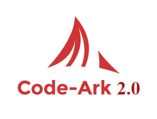

# Documentation of Code-Ark 2.0

## _**Features**_
#### The Removed Features are in red  Replaced features are in blue  New features are in green

*  Added Twig template and Twig rendered views  
   There is a composer.json file so any templating engine can be added,don't have to depend on twig anymore. 
  

* Error Log 
   Now we throwing exception. You can catch that exception and generate a dedicated class to show errors in your way. 
    
  
* HTTP status code based Error
  
  
* Custom 404 and 500 error message display page for production level 
  

* PDO Database connection
  

* Pretty URLs
  

* PSR-1 Coding standards 
  

* Exception Handler and Error Handler Throwing Exceptions.
  
  
* Development and Production Mode
  

* Autoload Classes using composer
  

* Registering Routes specifically for GET request and Post Request 
  

## **Configure** 
bla bla

## **Router**
In the routes file declare the routes like <code>$router->get('about', 'PagesController@about');</code> .
Name of the route is __'about'__, the controller's name is __PagesController__, and the method responsible is __'about'__ method. 
You must separate the controller and the method using __'@'__.   
  
************************************************************************************************************************ 
### __Composer and Dependency__
Run the __composer dump-autoload__ command to reload any new file. Can use this to add any needed dependency. 

 To add any __dependency injection__ use this code in the __bootstrap.php__ file to access it from anywhere in the application.
    <pre><code>     
        App::bind('config', require 'config.php');  
        App::bind('database', new QueryBuilder( 
        &nbsp;&nbsp;&nbsp;&nbsp;        Connection::make( App::get('config')['database']) 
        ));
    </code></pre>
 Here on the first line we are binding the dependency. In the bind(), __'config'__ is the label we are giving. Same goes 
 for the next line __database__ is just a label, and next we are creating a new QueryBuilder. 
 
 In the __controllers__ directory, inside the PagesController you will see,
 <pre><code>
  public function home() 
     { 
         $articles = App::get('database')->selectAll('articals');  
         return view('index'); 
     }
 </code></pre>
 
 In here we are getting the dependency so we can use it {I know the spelling is wrong, it was intended}. The __App::get__ 
 will get the dependency according to the label.
 
 
 
************************************************************************************************************************ 
## **Views**

Your view files are located in the views folder, and css and js files are located in to public folder.
The view files must follow a naming pattern. <code>index.view.php</code>  

If you want to change this style, navigate to bootstrap.php and change the view helper function
<pre><code>
function view($name, $data) 
{ 
    &nbsp;&nbsp;&nbsp;&nbsp;extract($data); 
    &nbsp;&nbsp;&nbsp;&nbsp;return require "views/{$name}.view.php"; 
}
</code></pre>

    

## **Models**

 Cache database connection
 
 Change Database information in the App/Config.php file. 

## **Exception Handler**

Converting errors into exception and then handling them, exceptions have the added benefit of having a __stack trace__, 
which is helpful when debugging.
 
 Change the __const SHOW_ERRORS__ in the config.php to toggle between development and user mode.
 
------------------------------------------------------------------------------------------------------------------------
 
 
