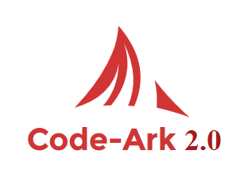

# Code-Ark 2.0

## _**Features**_
* __Removed__: Added Twig template and Twig rendered views  
  __Added__: There is a composer.json file so any templating engine can be added,don't have to depend on twig anymore. 

* __Removed__: Error Log 
 __Added__: Now we throwing exception. You can catch that exception and generate a dedicated class to show errors in your way. 
      
* __Removed__: HTTP status code based Error

* __Removed__: Custom 404 and 500 error message display page for production level

* __Added__: Namespaces.

* PDO Database connection

* Pretty URLs

* __Removed__: PSR-1 Coding standards  
  __Added__: PSR-2 Coding standards

* Exception Handler and Error Handler Throwing Exceptions.
  
* Development and Production Mode

* __New__: Autoload Classes using composer

* __New__: Registering Routes specifically for GET request and Post Request

## **Configure** 

The Code-Ark 2.0 is here!!! I have added and removed few features from the application. It's now more MVC base. It's now suitable
  for any small scale to medium scale projects.

Change the config.php to attach your database details. Thats the only change you have to do. I have an example application 
 for learning purposes, modify it or remove it entirely, it's up to you. This framework follows the basic MVC-R (Model, View, Controller, Router)
 structure. And also it's very easy to understand.

## **Router**
In the routes file declare the routes like <code>$router->get('about', 'PagesController@about');</code>  or   
<code>$router->post('about', 'PagesController@about');</code> 
Name of the route is __'about'__, the controller's name is __PagesController__, and the method responsible is __'about'__ method. 
You must separate the controller and the method using __'@'__.   
  
************************************************************************************************************************ 
### __Composer and Dependency__
Run the __composer dump-autoload__ command to reload any new file. Can use this to add any needed dependency. 

 To add any __dependency injection__ use this code in the __bootstrap.php__ file to access it from anywhere in the application.
    <pre><code>     
        App::bind('config', require 'config.php');  
        App::bind('database', new QueryBuilder( 
        &nbsp;&nbsp;&nbsp;&nbsp;        Connection::make( App::get('config')['database']) 
        ));
    </code></pre>
 Here on the first line we are binding the dependency. In the bind(), __'config'__ is the label we are giving. Same goes 
 for the next line __database__ is just a label, and next we are creating a new QueryBuilder. 
 
 In the __controllers__ directory, inside the PagesController you will see,
 <pre><code>
  public function home() 
     { 
         $articles = App::get('database')->selectAll('articals');  
         return view('index'); 
     }
 </code></pre>
 
 In here we are getting the dependency so we can use it {I know the spelling is wrong, it was intended}. The __App::get__ 
 will get the dependency according to the label.
 
 
 
************************************************************************************************************************ 
## **Views**

Your view files are located in the views folder, and css and js files are located in to public folder.
The view files must follow a naming pattern. <code>index.view.php</code>  

If you want to change this style, navigate to bootstrap.php and change the view helper function
<pre><code>
function view($name, $data) 
{ 
    &nbsp;&nbsp;&nbsp;&nbsp;extract($data); 
    &nbsp;&nbsp;&nbsp;&nbsp;return require "app/views/{$name}.view.php"; 
}
</code></pre>

    

## **Models**

  Change Database information in the __config.php__ file. 

## **Exception Handler**

In the __config.php__ file, the optional error mode has been declared as <code>PDO::ATTR_ERRMODE   =>   PDO::ERRMODE_EXCEPTION</code> 
You can change it and can also catch the error to show a 404 page or 400 page error.

In the core/database/Connection.php, you will find a PDO error display method showPdoError(), out of the box. 

 
------------------------------------------------------------------------------------------------------------------------
 
 
